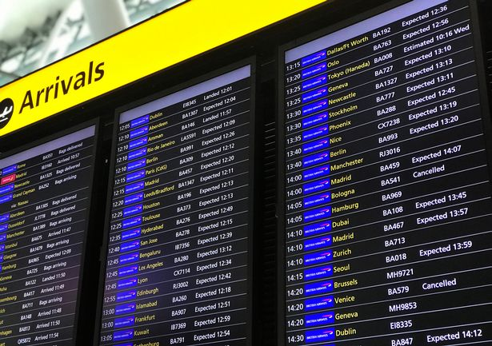

# Flight Information

  
  

Produces a table showing the flight details for all flights departing from or arriving at the selected airport.  
Various information has been included such as arrival & departure times, weather at arrival & departure locations, flight number,
flight status and flying conditions.
